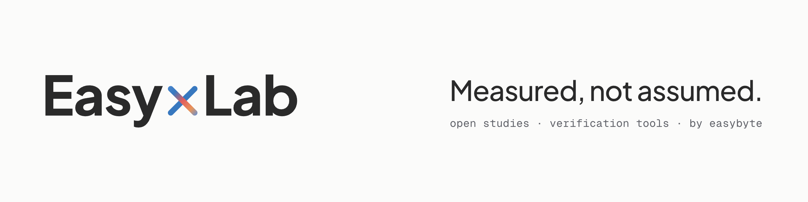

<picture>
  <source media="(prefers-color-scheme: dark)" srcset=".github/readme-banner-dark.png">
  
</picture>

# EasyxLab — studies

Original research by EasyxLab, the research lab of [EasyByte Hub S. Coop. Mad.](https://easybyte.es), a worker cooperative of software developers in Spain. Each study measures something practitioners usually take on faith, publishes its method and reproducible scripts, and releases its aggregated data.

| study | question | headline |
|---|---|---|
| [S1](studies/s1-verifactu-conformance/) | Do the XML records that open-source Verifactu implementations publish comply with Spain's rules? | Of 35 files presented as valid records, 10 (28.6%) contain at least one error; the most frequent defect is a declared hash that does not match the record. |
| [S2](studies/s2-spoofed-ai-crawlers/) | How much traffic that claims to be an AI or search crawler is real? | 39.3% of 16,548 claims on three small sites were spoofed; for user-initiated fetchers (ChatGPT-User, Claude-User, Perplexity-User…) 67.8%. |
| [S3](studies/s3-ai-marks-survival/) | Do AI provenance marks (C2PA, IPTC, China's AIGC label) survive common image, video and audio pipelines? | Every pixel or container rewrite removed the embedded C2PA manifest (124/124); editing one metadata field after signing left it present but invalid (6/6). |
| [S4](studies/s4-wikidata-drug-labels/) | How accurate are Wikidata's multilingual drug names? | About 0.9% of 34,207 labels are wrong (a lower bound), concentrated in Urdu, Persian, Russian and Hindi; 135 proposed corrections, not applied. |
| [S5](studies/s5-pypi-attestations/) | Who publishes PEP 740 attestations on PyPI and npm, and who stopped? | The latest version is attested for 3,479 of 14,995 top PyPI projects (23.2%); 138 projects that once attested no longer do in the line `pip` installs, 96 of them after a change of publishing tool or workflow. |
| [S6](studies/s6-commons-ai-marks/) | Do AI-generated images on Wikimedia Commons carry provenance marks? | Files with a machine-readable AI mark rose from 25.8% of January–May 2026 uploads to 50.2% of June–July uploads; our own validator, ai-mark-lint 0.1.0, wrongly rejected 187 valid C2PA manifests (fixed in 0.1.1). |
| [S7](studies/s7-aio-spanish-regulation/) | Do Google's AI Overviews and AI Mode keep up with Spanish rule changes? | Judged against the consolidated law in force on 2 October 2026, 12 of 240 AI Overview answers (5.0%) and 13 of 291 AI Mode answers (4.5%) on 27 recently changed rules were outdated or wrong. |
| [S8](studies/s8-spanish-public-sector-web/) | What can a machine verify on Spain's public-sector websites? | Of 5,130 public-sector home pages served over HTTPS, 1,688 (32.9%) send HSTS; of 5,570 entities, 4 serve a `security.txt` that is strictly valid under RFC 9116. |
| [S10](studies/s10-netex-naps/) | Are the public-transport NeTEx timetables on Europe's national access points valid against the open schemas? | 8 of 34 timetable datasets from five national access points are fully valid against the NeTEx XSD, all of them French; the static MMTIS deadlines passed in 2019–2025, and the 1 December 2026 date covers parking and vehicle sharing, not timetables. |

Each study folder contains `README.md` (abstract), `METHOD.md`, `paper.md` (the full report), the scripts that regenerate every figure, and the aggregated data.

## How these studies were made

The studies were run by AI agents supervised by EasyByte: collection, classification, analysis and drafting. Every paper was then checked by an independent AI reviewer, which recomputed the figures from the data, verified each quotation against its source and re-ran the scripts where feasible. **No human expert has reviewed the findings.** Each paper has an "Automation and review" section stating exactly what was automated. The point of publishing the scripts and data is that anyone can check the results.

## Competing interests

EasyByte develops [verifactu-lint](https://github.com/easybytehub/verifactu-lint), the instrument of S1, and offers commercial Verifactu services. EasyByte also develops [ai-mark-lint](https://github.com/easybytehub/ai-mark-lint), which automates the before/after comparison in S3 and is the validator whose defects S6 found and reported. It develops [attest-lint](https://github.com/easybytehub/attest-lint), which flags in a lockfile the attestation regressions S5 measures. The sites in S2 are EasyByte's own and are anonymised as Site A, B and C.

## What is not here

- **Third-party files** (S1) and **raw access logs** (S2) are not redistributed. S1 publishes anonymised repository IDs; S2 publishes aggregates only, with no IP addresses.
- **Nothing was submitted, uploaded or edited elsewhere.** S4's Wikidata corrections are proposals for a Wikidata editor to review.

## Licences

- **Code** (`scripts/`, `tests/`): Apache-2.0, see [LICENSE](LICENSE).
- **Data, fixtures and text:** CC BY 4.0, see [LICENSE-DATA](LICENSE-DATA).
- **Exception, S4:** its data and corrections derive from Wikidata (CC0) and are meant to go back there, so they are released under CC0 1.0 ([studies/s4-wikidata-drug-labels/LICENSE-DATA](studies/s4-wikidata-drug-labels/LICENSE-DATA)).

Cite a study as: *EasyxLab (2026). [title of the study]. Study Sn. EasyByte Hub S. Coop. Mad. https://github.com/easybytehub/easyxlab*.

---

EasyxLab · a research lab by [EasyByte](https://easybyte.es)
